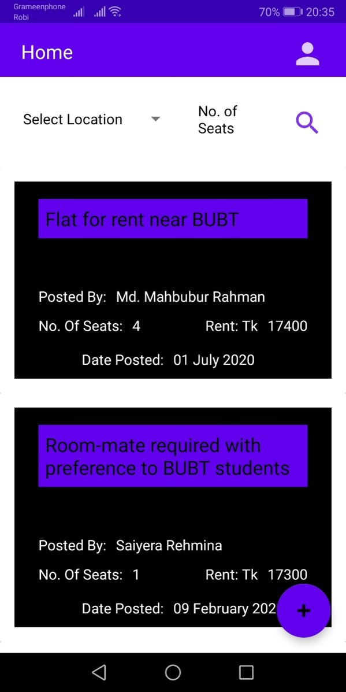

# STUDENT ROOM RENTAL (ANDROID)

## DESCRIPTION

This system is intended to search for and post about rooms for rent exclusively for students of all manner. It is designed to cater to students in search for a place to live when they leave their houses to get an education away from home. As students in a new city, trying to navigate their lives in the newness of everything is very tough for students. With no permanent place to stay, they are always on the lookout for affordable housing solutions that are in comfortable environments. At such a time, they also prefer to get housing with other students. On the other hand, students who already have a place to stay, but need someone else to share the burden of the rent with, have to get the word out there through different means, such as posting on various Facebook groups and asking people around. This system provides a one stop solution to both parties.

## TOOLS AND TECHNOLOGIES

- *Front-End language:* XML
- *Back-End language:* Java
- *Database language:* JSON
- **Firebase**
  - Realtime Database
  - Cloud Storage
  - User Authentication Service

## SYSTEM FEATURES

- Search for a room rental ad.
- See an ad publisher's contact information.
- Approve ads for room rentals.
- Delete posted ads.
- Get monthly reports on the system.

## SYSTEM ARCHITECTURE

## KEY SYSTEM IMAGES

### Homepage

### Ad View

### Posting An Ad

### Rent Requests

### Admin Ad Review

## FUTURE WORK

1. Adding a chat module to allow direct communication between the student and ad publisher through the system.
2. At the moment, the system includes a placeholder Google Map viewer. It works as a basic map through the Google Maps API. However, due to the Google Places API being behind a paywall, geolocation is not included into the system yet. This feature is still under development.